# High-Level Design (HLD)
**Project Name:** AI for Digital Public Safety (Distributed Platform)

---

## 1. Executive Summary
This High-Level Design (HLD) document defines the system architecture for the Digital Public Safety Distributed Platform. It translates the requirements outlined in the System Requirements Specification (SRS) into a concrete, cloud-agnostic microservices architecture. 

### 1.1 Architectural Boundary (AI Scope)
The design strictly separates the stateful, distributed workflow orchestration from the external AI Inference Platform to prevent scope creep.

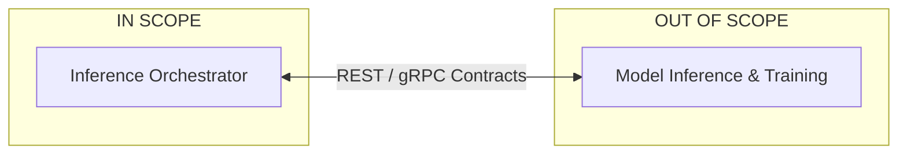

## 2. Architecture Principles
*   **Cloud-Agnostic:** Containerized, open-source technologies (e.g., Kubernetes, Kafka, PostgreSQL) allow deployment across AWS, Azure, GCP, or on-premises data centers with minimal modifications.
*   **Database-per-Service:** Each microservice completely owns its domain data. Direct database sharing is prohibited. In production, PgBouncer (transaction-mode connection pooler) sits in front of PostgreSQL to prevent DB connection exhaustion under horizontal scaling. For the hackathon demo, services connect directly to Postgres on port 5432.
*   **CQRS & Event-Driven Architecture (EDA):** The platform separates write models (ACID transactions) from read models (search/dashboards). State changes emit domain events, which update downstream read projections asynchronously. All Kafka topics are provisioned with **12 partitions** to allow up to 12 consumer pods per consumer group without rebalancing overhead.
*   **API-First & Contract Layer:** External APIs are versioned and strictly documented via OpenAPI specifications.
    *   **Production (Kubernetes):** Internal service-to-service communication uses **gRPC with strongly typed, versioned Protocol Buffers contracts** — lower latency, binary serialization, native streaming. Istio handles mTLS over gRPC automatically.
    *   **Docker Compose (local/demo):** Internal communication uses **HTTP/1.1 via `httpx.AsyncClient`** with connection pools. This provides identical contract semantics with simpler debugging and no proto compilation step.
*   **Stateless Horizontal Scaling:** All application services are stateless. All state is externalized to PostgreSQL, Redis, Neo4j, PostGIS, OpenSearch, or Kafka. Any service can be scaled to N replicas — Kafka consumer groups handle partition rebalancing automatically.
*   **Secrets Management:** Services read configuration from environment variables (`.env`) for the hackathon demo. Production deployment uses HashiCorp Vault with Vault Agent sidecar injection.
*   **Scalability Target:** 1M+ concurrent users, 5,000 RPS peak, 50,000 streaming events/second (SRS §10).

---

## 3. High-Level Logical Architecture

### 3.1 Domain Interaction Map
This component map illustrates the high-level flow of data across the distributed domains during a standard investigation.

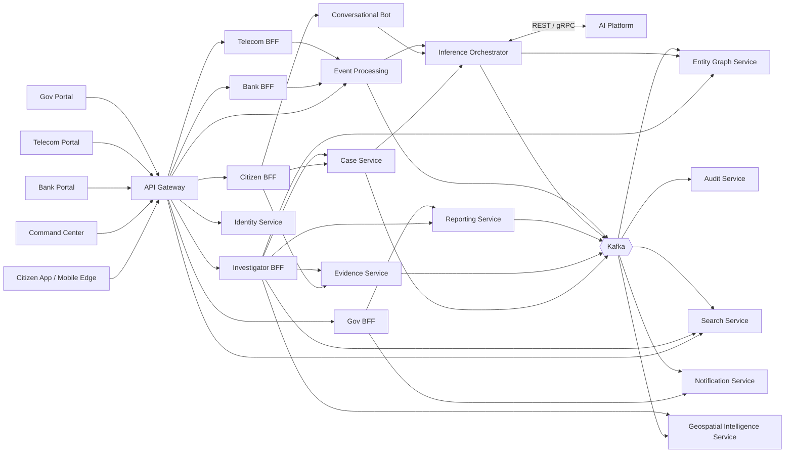

### 3.2 Control Plane vs. Data Plane
The architecture is explicitly divided into a **Control Plane** (managing platform operations, edge routing, and security) and a **Data Plane** (managing business logic, investigations, and inference).

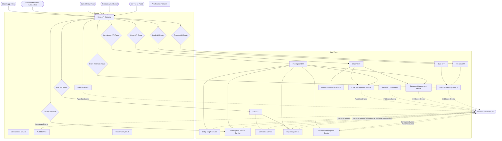

---

## 4. Core Services Definition

The platform is decomposed into **15 core services**. To bridge naturally into the Low-Level Design (LLD), the API contracts and event flows are summarized below.

### 4.1 Edge & Aggregation Layers
1.  **API Gateway:**
    *   *Technology:* **Kong 3 (DB-less mode)**. Declarative YAML configuration in `/infra/kong/kong.yml` — no Kong database required.
    *   *Responsibilities:* Edge proxy, JWT validation (RS256), rate limiting (IP + token), correlation ID injection.
    *   *Plugins active (hackathon):* `jwt`, `rate-limiting`, `correlation-id`, `response-ratelimiting`.
    *   *Production extensions:* `request-id`, `opentelemetry` (traces routed via OTel Collector to Tempo).
2.  **BFFs (Citizen, Investigator, Bank, Telecom, Gov):**
    *   *Responsibilities:* Aggregates microservice data for UI consumption. Owned by Surjit (Citizen, Bank, Telecom) and Nilkanta (Investigator, Gov).

### 4.2 Control Plane Services
3.  **Identity Service:**
    *   *Provides:* `Login`, `Verify MFA`, `Manage RBAC`
    *   *Publishes:* `User.Registered`, `User.LoginFailed`
4.  **Configuration Service:**
    *   *Responsibilities:* Feature flags, env profiles, fusion weight management.
    *   *Hackathon implementation:* Redis keys (`fusion:weights`, `fusion:enabled_models`) serve this function directly — satisfying FR-14.4 (hot-reload without restart) without a separate service binary. Production Kubernetes deployment uses a dedicated Configuration Service backed by Vault and Redis.
5.  **Audit Service:**
    *   *Responsibilities:* Immutable ledger.
    *   *Consumes:* `*.Created`, `*.Updated` (All state changes)

### 4.3 Data Plane Services
6.  **Case Management Service:** 
    *   *Provides:* `Create Case`, `Update Case State`, `Assign Case`
    *   *Consumes:* `Prediction.Completed`, `Evidence.Verified`
    *   *Publishes:* `Case.Created`, `Case.Updated`, `Case.Assigned`
7.  **Inference Orchestrator Service:** 
    *   *Provides:* `Request Prediction`, `Get Prediction Status`
    *   *Consumes:* `Case.Created`, `Evidence.Uploaded`
    *   *Publishes:* `Prediction.Requested`, `Prediction.Completed`, `Prediction.Failed`
8.  **Event Processing Service:** 
    *   *Provides:* Ingestion webhooks for external async telemetry; synchronous gRPC streaming endpoint for the real-time interdiction path.
    *   *Publishes:* `TelecomEvent.Ingested`, `Transaction.Ingested`, `Intervention.Requested`
9.  **Entity Graph Service:** 
    *   *Provides:* `Query Linkages`, `Find Shortest Path`
    *   *Consumes:* `Case.Created`, `Prediction.Completed`
    *   *Publishes:* `Entity.RelationshipDiscovered`
10. **Evidence Management Service:** 
    *   *Provides:* `Upload Evidence`, `Generate Presigned URL`, `Verify Hash`
    *   *Consumes:* `Case.Closed` (Triggers archival lock)
    *   *Publishes:* `Evidence.Uploaded`, `Evidence.Deleted`
11. **Investigation Search Service:** 
    *   *Provides:* `Fuzzy Search`, `Faceted Filter`
    *   *Consumes:* `Case.*`, `Evidence.*`, `Prediction.*` (Builds eventually consistent read model)
12. **Notification Service:** 
    *   *Provides:* `Send Alert`, `Update Preferences`, `Dispatch MHA Alert`
    *   *Consumes:* `Prediction.Completed`, `Case.Assigned`, `CallSession.Flagged`
    *   *Publishes:* `Notification.Requested`, `Notification.Sent`, `MHAAlert.Sent`
    *   *Note:* The MHA alert channel is a high-priority, dedicated webhook path bypassing standard notification queues. Delivery latency SLO: < 5 seconds from `CallSession.Flagged`.
13. **Conversational Bot Service:**
    *   *Provides:* `Process Message`, `Get Session State`
    *   *Note:* Strictly proxies all NLP requests through the Inference Orchestrator to maintain a single, tightly controlled AI integration boundary.
14. **Reporting Service:** 
    *   *Provides:* `Generate NCRB Report`, `Export CSV`, `Generate Intelligence Package`
    *   *Consumes:* `Case.Closed`, `Audit.Recorded`
    *   *Publishes:* `Report.Generated`, `IntelligencePackage.Generated`
    *   *Note:* Intelligence Packages are cryptographically signed bundles (case records, evidence hashes, graph exports, AI audit trail, chain-of-custody logs) suitable for court submission.
15. **Geospatial Intelligence Service:**
    *   *Provides:* `Get Hotspot Map`, `Query Patrol Zones`, `Export GeoJSON Layer`, `Get Cross-District Density`
    *   *Consumes:* `Case.Created`, `CounterfeitScan.Submitted`, `Prediction.Completed`
    *   *Publishes:* `GeoLayer.Updated`
    *   *Note:* Geospatial data is stored in PostGIS. Hotspot layer updates must occur within 60 seconds of the triggering event. Cross-district queries are scoped to the requesting investigator's RBAC jurisdiction.

---

## 5. Data Architecture & CQRS

### 5.1 Domain Ownership Diagram
Each bounded context strictly owns its data.

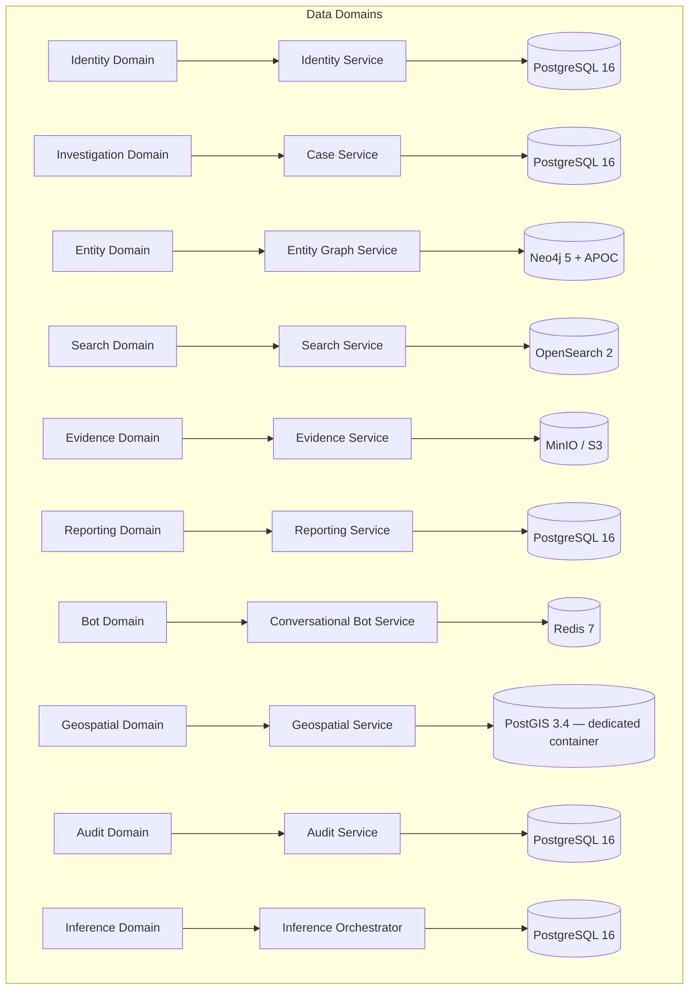

> **Data Store Notes:** PostGIS runs in its own dedicated container (`postgis/postgis:16-3.4`), separate from the primary PostgreSQL instance, to maintain strict Database-per-Service isolation. OpenSearch serves as the CQRS read model for case and evidence search. Each domain's PostgreSQL tables live in the primary instance under separate schemas.

### 5.2 Command Query Responsibility Segregation (CQRS) & Transactional Outbox
To optimize complex dashboards without joining across microservices, the architecture uses CQRS powered by the **Transactional Outbox Pattern**. State mutations (Commands) occur in PostgreSQL alongside an Outbox table. An outbox publisher relays these to Kafka, updating downstream read projections asynchronously.

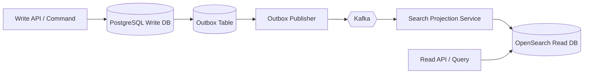

---

## 6. Event Streaming Architecture

### 6.1 Kafka Architecture Flow
All events are published as plain JSON. The platform uses Kafka KRaft mode (no Zookeeper) with **12 partitions per topic** for parallel consumer scaling. In production, a Confluent Schema Registry enforces backward and forward JSON Schema compatibility at the producer before reaching the broker.

Kafka runs in **KRaft mode** (Kafka 3.6+, `bitnamilegacy/kafka:3.6`). No Zookeeper.

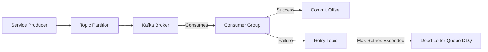

> **Hackathon:** Producers publish plain JSON directly to Kafka (no Schema Registry validation). In production, a Confluent Schema Registry step sits between producer and partition, enforcing backward/forward JSON Schema compatibility.

### 6.2 Standardized Event Naming
Naming consistency is strictly enforced across all domain boundaries using the `Noun.PastTenseVerb` convention:
*   `Case.Created`, `Case.Updated`, `Case.Assigned`, `Case.Closed`
*   `Evidence.Uploaded`, `Evidence.Deleted`
*   `Audio.Uploaded`, `Audio.Processed`
*   `Prediction.Requested`, `Prediction.Completed`, `Prediction.Failed`, `Prediction.Overridden`
*   `Entity.RelationshipDiscovered`
*   `CallSession.Initiated`, `CallSession.Flagged`
*   `Intervention.Requested`
*   `CounterfeitScan.Submitted`
*   `FraudRing.NodeIdentified`
*   `GeoLayer.Updated`
*   `Notification.Requested`, `Notification.Sent`, `Notification.Delivered`, `Notification.Failed`
*   `MHAAlert.Sent`
*   `IntelligencePackage.Generated`
*   `User.Registered`, `User.LoginFailed`
*   `Audit.Recorded`
*   `Report.Generated`

---

## 7. Request Flows & Architectural Patterns

### 7.1 API Lifecycle (Edge Routing)
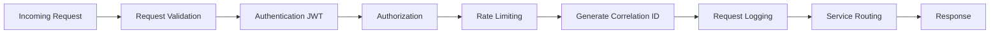

### 7.2 Failure Handling & Circuit Breaking
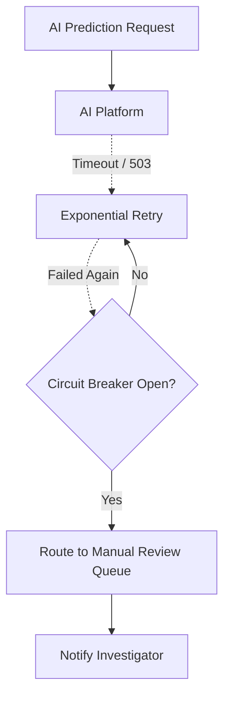

### 7.3 Sub-second Real-Time Scam Interdiction
To satisfy the < 300ms SLA for active scam intervention (before a financial transfer occurs), the platform provides a dedicated synchronous ingestion path that intentionally bypasses the async Kafka event bus. **Every interdiction decision is still written to the Audit Service asynchronously** (via Kafka's `Intervention.Requested` event) to satisfy the legal admissibility requirement.
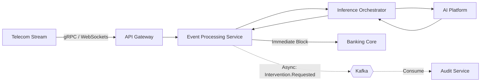

### 7.4 Edge Inference & Offline Sync Strategy
To support offline counterfeit detection on mobile devices and bank counting machines, the platform syncs quantized ML models directly to the edge. The system tolerates model version skew. Because offline scan logs are potentially evidentiary, **conflict resolution defaults to flagging near-duplicates for manual investigator review** rather than silently discarding one record (Last-Write-Wins is only used for non-evidentiary telemetry).
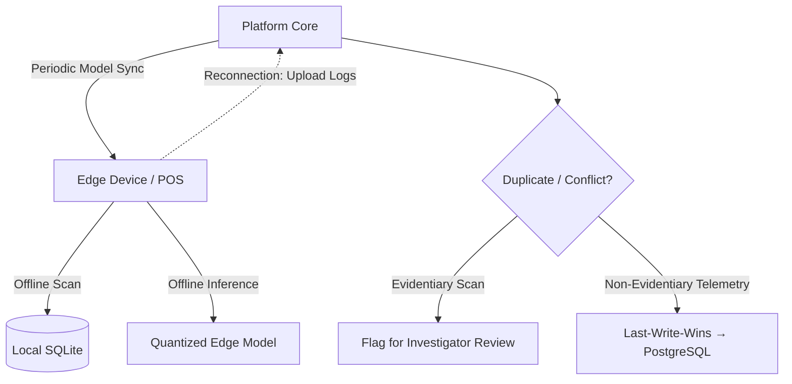

### 7.5 Human-in-the-Loop Override Flow
When the Inference Orchestrator generates a fused verdict below the configured confidence threshold, automated high-impact actions are suppressed and the case is routed to a manual review queue. All investigator override decisions are written to the Audit Service as immutable records.
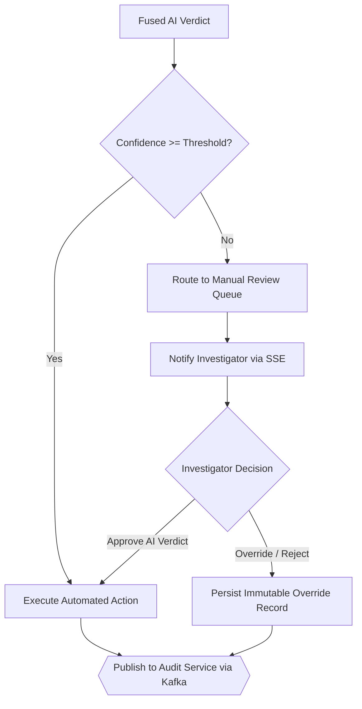

### 7.6 Multi-Source Inference Fusion Flow
The Inference Orchestrator dispatches parallel invocations to each applicable AI endpoint. A Fusion Layer aggregates results into a single composite verdict. Partial failures do not block persistence — they produce an `INCOMPLETE` verdict routed for manual review.
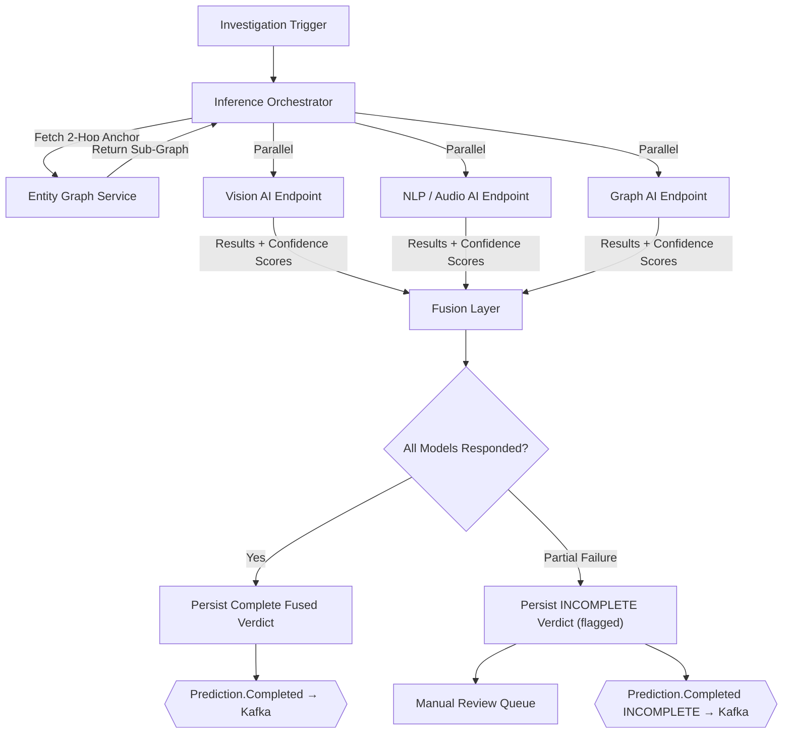

---

## 8. State & Sequence Diagrams

### 8.1 Case State Machine
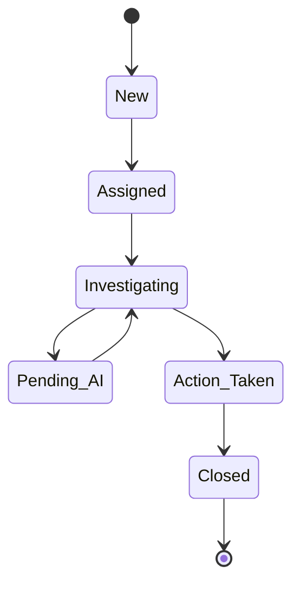

### 8.2 Sequence: Complaint Submission
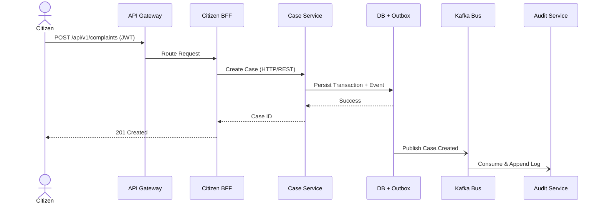

### 8.3 Sequence: AI Prediction & Investigation
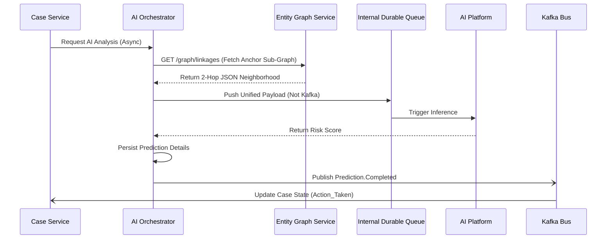

---

## 9. Cross-Cutting Concerns

*   **Authentication & Authorization:** JWT validation and initial RBAC evaluation are offloaded to the API Gateway. Services only perform fine-grained resource authorization.
*   **Caching:** Implemented via the **Cache-Aside Pattern** using Redis to reduce DB load. Eviction policies: TTL-based for sessions/OTPs; LRU/LFU for cached read models.
*   **Logging & Tracing:** Structured JSON logs are emitted by all services. OpenTelemetry automatically propagates `trace_id` headers.
*   **Rate Limiting:** Enforced globally at the API Gateway (IP + token-based per FR-2.5), and locally at the service mesh layer for inter-service RPCs.
*   **Feature Flags & Secrets:** Configuration Service manages feature flags and fusion weights via Redis keys (hot-reload, FR-14.4). Secrets are read from `.env` in the hackathon demo; production uses HashiCorp Vault with Vault Agent sidecar injection.

---

## 10. External Dependencies

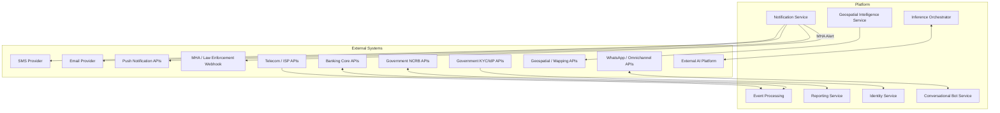

---

## 11. Observability Stack

All services emit **structured JSON logs** via `loguru` (Python). The OpenTelemetry SDK (`opentelemetry-sdk`, `opentelemetry-instrumentation-fastapi`) auto-instruments every FastAPI service — traces propagated via W3C Trace Context headers. Every service exposes:
- `GET /health` → `{status, version, uptime_s}` — polled by Kong upstream health checks and the Inference Orchestrator for ML service readiness.
- `GET /metrics` → Prometheus text format — auto-generated by `prometheus-fastapi-instrumentator`.

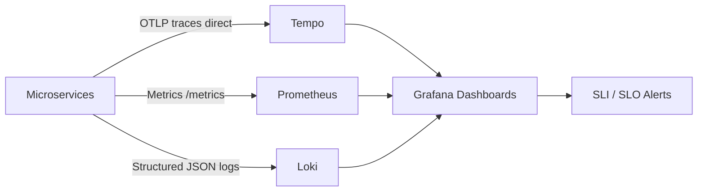

> **Hackathon simplification:** Services send OTLP traces directly to Tempo (port 4317) and push logs directly to Loki's HTTP API. In production, an OpenTelemetry Collector routes traces/logs from all services to the appropriate backends, and Promtail scrapes container logs. Both production components remain in the architecture diagram for judges.

---

## 12. Platform Operations

The platform requires robust DevOps practices to maintain the 99.99% availability SLA:
*   **Rolling Updates & Deployments:** Zero-downtime rolling updates. High-risk services utilize Canary or Blue-Green deployments.
*   **Kubernetes Constraints:** All workloads define strict Resource Requests/Limits, Pod Disruption Budgets (PDBs), and Affinity Rules to guarantee node distribution.
*   **Autoscaling:** Kubernetes HPA triggers dynamically based on Prometheus metrics.
*   **Backup & Restore:** Automated daily snapshots (Postgres/Neo4j) with strictly **intra-country** cross-region replication to comply with DPDP Act data residency requirements. Includes periodic restore verification drills and strict backup encryption.
*   **Certificate Rotation:** Automated via `cert-manager` within Kubernetes; `cert-manager` is a critical-path operational dependency (not optional tooling) given the mandatory mTLS enforcement.
*   **Chaos Testing:** Periodic failure injection (e.g., random pod termination, Kafka broker restart) is executed in staging environments to validate resilience patterns (circuit breakers, DLQs), satisfying the Reliability Acceptance Criterion (SRS §19).

---

## 13. Deployment View

The platform is designed to run on a container orchestration system (Kubernetes), organized into strict network layers. A **Mandatory Service Mesh (Istio 1.21 with sidecar injection)** enforces zero-trust mTLS between all services, handles traffic routing policies, circuit breaking, and retry logic.

*Note: mTLS handshake overhead is factored into the 1.5s API SLA. `cert-manager` is a critical-path operational dependency that automates certificate rotation for all Istio-managed services.*

**Local Docker Compose equivalent:** Kong handles TLS termination at the gateway layer. All inter-service communication is plain HTTP within the isolated Docker bridge network (`172.20.0.0/16`). Production Kubernetes uses Istio mTLS for full zero-trust enforcement.

```mermaid
flowchart TD
    Internet[Internet] --> WAF[Web Application Firewall]
    WAF --> ALB[Load Balancer]
    ALB --> Gateway[API Gateway]
    
    subgraph Kubernetes Cluster
        Gateway --> Ingress[K8s Ingress Controller]
        Ingress --> Mesh[Mandatory Service Mesh / Istio]
        
        subgraph K8s Control Plane
            API_Server[API Server]
            Scheduler[Scheduler]
            Controller[Controller Manager]
        end
        
        subgraph Worker Node 1
            Pod_Cit[Citizen BFF Deployment]
            Pod_Case[Case Service Deployment]
            Pod_Bot[Conversational Bot Deployment]
            Pod_Auth[Identity Service Deployment]
            Pod_Evidence[Evidence Service Deployment]
        end
        
        subgraph Worker Node 2
            Pod_Inv[Investigator BFF Deployment]
            Pod_Gov[Gov BFF Deployment]
            Pod_Orch[Inference Orch Deployment]
            Pod_Report[Reporting Service Deployment]
            Pod_Entity[Entity Graph Service Deployment]
            Pod_Geo[Geospatial Service Deployment]
        end
        
        subgraph Worker Node 3
            Pod_Search[Search Service Deployment]
            Pod_Event[Event Service Deployment]
            Pod_Bank[Bank BFF Deployment]
            Pod_Telco[Telecom BFF Deployment]
            Pod_Audit[Audit Service Deployment]
            Pod_Notify[Notification Service Deployment]
        end
        
        Mesh --> Pod_Cit & Pod_Inv & Pod_Search & Pod_Case & Pod_Orch & Pod_Event & Pod_Bot & Pod_Report & Pod_Gov & Pod_Bank & Pod_Telco & Pod_Auth & Pod_Evidence & Pod_Entity & Pod_Geo & Pod_Audit & Pod_Notify
    end

    subgraph Data Layer [Isolated Subnet]
        Postgres[(PostgreSQL StatefulSet)]
        PostGIS[(PostGIS StatefulSet)]
        Neo4j[(Neo4j StatefulSet)]
        OpenSearch[(OpenSearch StatefulSet)]
        Kafka{{Kafka StatefulSet}}
        Redis[(Redis StatefulSet)]
        MinIO[(MinIO / S3 StatefulSet)]
    end

    Worker Node 1 & Worker Node 2 & Worker Node 3 --> Data Layer
```
