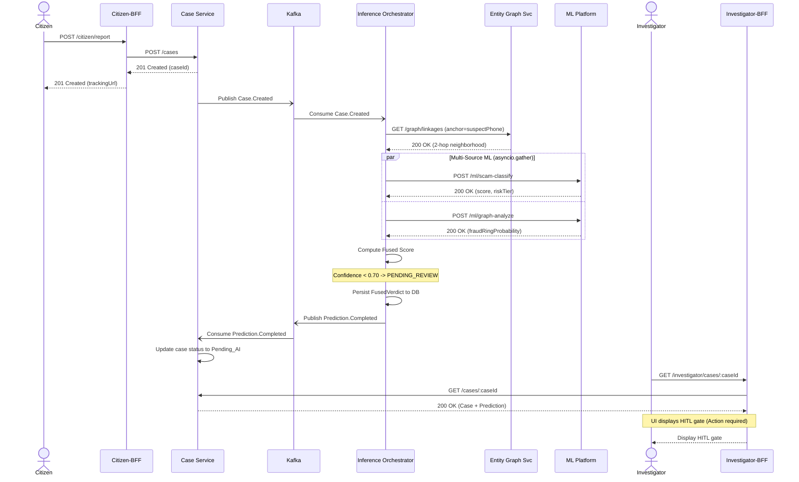

# 1. Citizen Report & AI Fusion HITL Gate

This sequence maps the flow of a citizen submitting a fraud report. The report automatically triggers an asynchronous multi-model AI evaluation. If the fused AI confidence falls below a defined threshold, the case is routed to a Human-in-the-Loop (HITL) gate for manual review.

