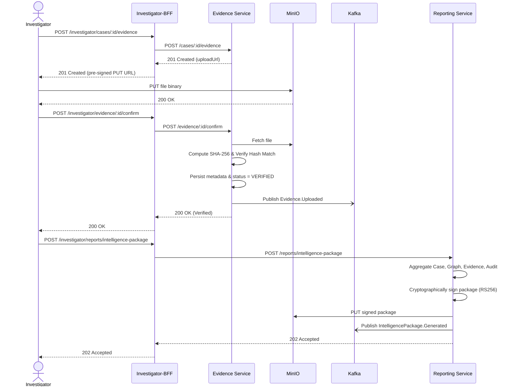

# 2. Evidence Upload & Intelligence Package

This flow demonstrates how investigators upload binary evidence bypassing the API layer (via pre-signed URLs), trigger cryptographic hash verification, and subsequently generate a signed, court-admissible intelligence package for prosecution.

