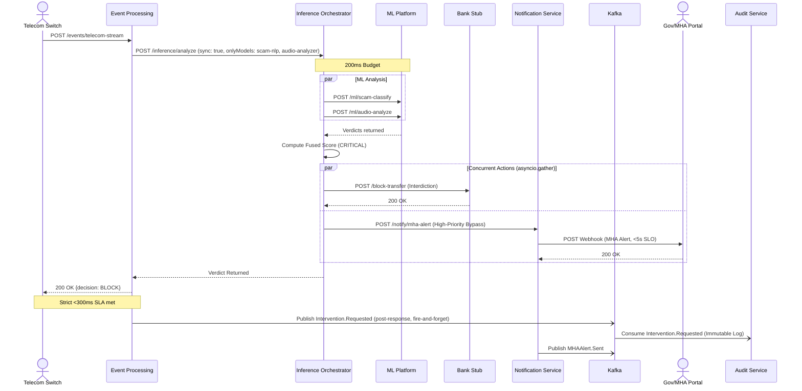

# 3. Synchronous Telecom Interdiction & MHA Alert

This ultra-low-latency flow demonstrates the synchronous interception of a telecom call. The Orchestrator bypasses Kafka, directly queries specific ML models, and concurrently dispatches a network-level block and a high-priority government webhook, all within strict SLAs.

