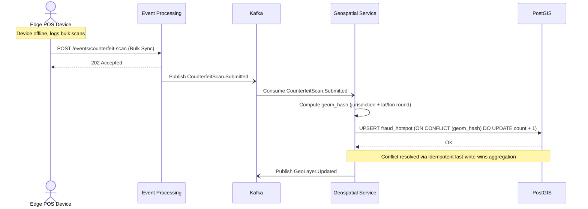

# 4. Offline Counterfeit Sync & Conflict Resolution

Edge POS devices operate offline and sync scan logs upon regaining connectivity. This flow illustrates how the system resolves near-duplicate conflicts (e.g., multiple POS scanning the same note at the same time) using an idempotent spatial upsert.

