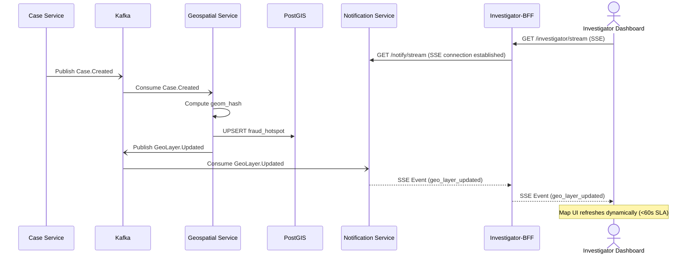

# 5. Case Created to Real-Time Dashboard Push

This asynchronous flow traces how the creation of a new case propagates through the geospatial intelligence layer and is pushed in real-time to active investigator dashboards via Server-Sent Events (SSE).

