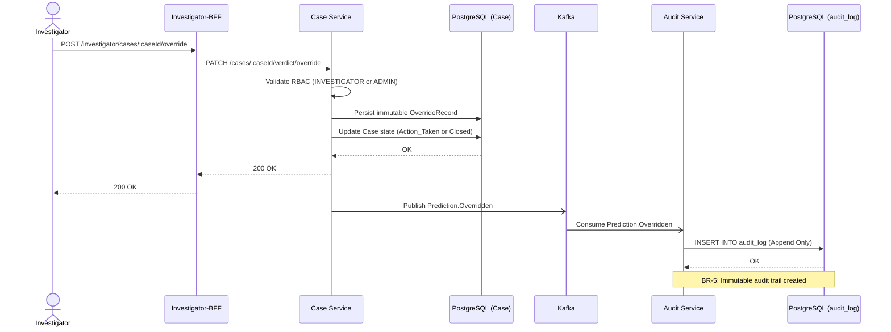

# 6. HITL Override & Immutable Audit Trail

When an investigator manually overrides an AI verdict, the system enforces RBAC, executes a state machine transition, and creates an append-only cryptographic audit log to fulfill core compliance requirements.

