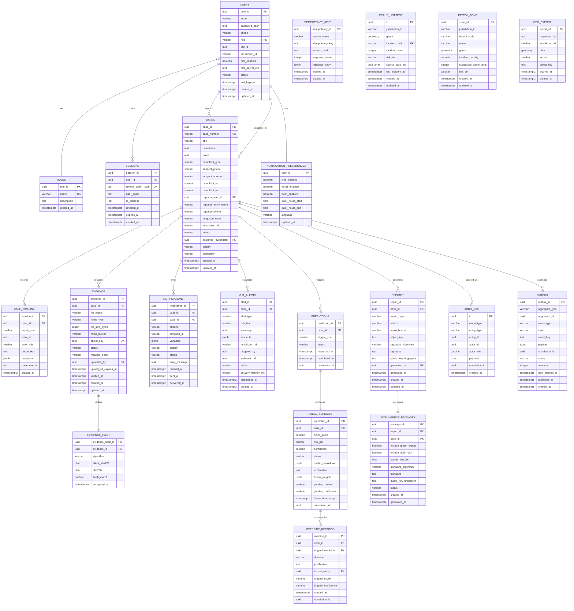

# Entity Relationship Diagram (Detailed)

This diagram visualizes the PostgreSQL schemas defined in `postgres.sql` and `postgis.sql`, including all table properties and relationships.

```mermaid
erDiagram
    USERS {
        uuid user_id PK
        varchar email
        text password_hash
        varchar phone
        varchar role FK
        uuid org_id
        varchar jurisdiction_id
        boolean mfa_enabled
        text mfa_secret_enc
        varchar status
        timestamptz last_login_at
        timestamptz created_at
        timestamptz updated_at
    }
    ROLES {
        uuid role_id PK
        varchar name UK
        text description
        timestamptz created_at
    }
    SESSIONS {
        uuid session_id PK
        uuid user_id FK
        text refresh_token_hash UK
        text user_agent
        inet ip_address
        timestamptz revoked_at
        timestamptz expires_at
        timestamptz created_at
    }
    CASES {
        uuid case_id PK
        varchar case_number UK
        varchar title
        text description
        text notes
        varchar complaint_type
        varchar suspect_phone
        varchar suspect_account
        numeric complaint_lat
        numeric complaint_lon
        uuid reporter_user_id FK
        varchar reporter_entity_name
        varchar reporter_phone
        varchar language_code
        varchar jurisdiction_id
        varchar status
        uuid assigned_investigator FK
        varchar priority
        varchar disposition
        timestamptz created_at
        timestamptz updated_at
    }
    CASE_TIMELINE {
        uuid timeline_id PK
        uuid case_id FK
        varchar event_type
        uuid actor_id
        varchar actor_role
        text description
        jsonb metadata
        uuid correlation_id
        timestamptz created_at
    }
    EVIDENCE {
        uuid evidence_id PK
        uuid case_id FK
        varchar file_name
        varchar mime_type
        bigint file_size_bytes
        varchar minio_bucket
        text object_key UK
        varchar status
        varchar malware_scan
        uuid uploaded_by FK
        timestamptz upload_url_expires_at
        timestamptz verified_at
        timestamptz created_at
        timestamptz updated_at
    }
    EVIDENCE_HASH {
        uuid evidence_hash_id PK
        uuid evidence_id FK
        varchar algorithm
        char client_sha256
        char sha256
        boolean hash_match
        timestamptz computed_at
    }
    NOTIFICATIONS {
        uuid notification_id PK
        uuid user_id FK
        uuid case_id FK
        varchar channel
        varchar template_id
        jsonb variables
        varchar priority
        varchar status
        text error_message
        timestamptz queued_at
        timestamptz sent_at
        timestamptz delivered_at
    }
    NOTIFICATION_PREFERENCES {
        uuid user_id PK
        boolean sms_enabled
        boolean email_enabled
        boolean push_enabled
        time quiet_hours_start
        time quiet_hours_end
        varchar language
        timestamptz updated_at
    }
    MHA_ALERTS {
        uuid alert_id PK
        uuid case_id FK
        varchar alert_type
        varchar risk_tier
        text summary
        jsonb suspects
        varchar jurisdiction_id
        uuid triggered_by
        text webhook_url
        varchar status
        integer delivery_latency_ms
        timestamptz dispatched_at
        timestamptz created_at
    }
    PREDICTIONS {
        uuid prediction_id PK
        uuid case_id FK
        varchar trigger_type
        varchar status
        timestamptz requested_at
        timestamptz completed_at
        uuid correlation_id
    }
    FUSED_VERDICTS {
        uuid prediction_id PK
        uuid case_id FK
        numeric fused_score
        varchar risk_tier
        numeric confidence
        varchar status
        jsonb model_breakdown
        text explanation
        jsonb fusion_weights
        boolean pending_review
        boolean pending_notification
        timestamptz fusion_timestamp
        uuid correlation_id
    }
    OVERRIDE_RECORDS {
        uuid override_id PK
        uuid case_id FK
        uuid original_verdict_id FK
        varchar decision
        text justification
        uuid investigator_id FK
        numeric original_score
        numeric original_confidence
        timestamptz created_at
        uuid correlation_id
    }
    REPORTS {
        uuid report_id PK
        uuid case_id FK
        varchar report_type
        varchar status
        varchar minio_bucket
        text object_key
        varchar signature_algorithm
        text signature
        text public_key_fingerprint
        uuid generated_by FK
        timestamptz generated_at
        timestamptz created_at
        timestamptz updated_at
    }
    INTELLIGENCE_PACKAGES {
        uuid package_id PK
        uuid report_id FK
        uuid case_id FK
        boolean include_graph_export
        boolean include_audit_trail
        char bundle_sha256
        varchar signature_algorithm
        text signature
        text public_key_fingerprint
        varchar status
        timestamptz created_at
        timestamptz generated_at
    }
    AUDIT_LOG {
        uuid id PK
        varchar event_type
        varchar entity_type
        uuid entity_id
        uuid actor_id
        varchar actor_role
        jsonb payload
        uuid correlation_id
        timestamptz created_at
    }
    OUTBOX {
        uuid outbox_id PK
        varchar aggregate_type
        uuid aggregate_id
        varchar event_type
        varchar topic
        text event_key
        jsonb payload
        uuid correlation_id
        varchar status
        integer attempts
        timestamptz next_attempt_at
        timestamptz published_at
        timestamptz created_at
    }
    IDEMPOTENCY_KEYS {
        uuid idempotency_id PK
        varchar service_name
        uuid idempotency_key
        text request_hash
        integer response_status
        jsonb response_body
        timestamptz expires_at
        timestamptz created_at
    }
    FRAUD_HOTSPOT {
        uuid id PK
        varchar jurisdiction_id
        geometry geom
        varchar location_hash UK
        integer incident_count
        varchar risk_tier
        uuid_array source_case_ids
        timestamptz last_incident_at
        timestamptz created_at
        timestamptz updated_at
    }
    PATROL_ZONE {
        uuid zone_id PK
        varchar jurisdiction_id
        varchar district_code
        varchar name
        geometry geom
        numeric incident_density
        integer suggested_patrol_units
        varchar risk_tier
        timestamptz created_at
        timestamptz updated_at
    }
    GEO_EXPORT {
        uuid export_id PK
        uuid requested_by
        varchar jurisdiction_id
        geometry bbox
        varchar format
        text object_key
        timestamptz expires_at
        timestamptz created_at
    }

    USERS }|--|| ROLES : has
    USERS ||--o{ SESSIONS : owns
    USERS ||--|| NOTIFICATION_PREFERENCES : has
    USERS ||--o{ CASES : reports
    USERS ||--o{ CASES : assigned_to
    CASES ||--o{ CASE_TIMELINE : records
    CASES ||--o{ EVIDENCE : contains
    EVIDENCE ||--|| EVIDENCE_HASH : verifies
    CASES ||--o{ PREDICTIONS : triggers
    PREDICTIONS ||--|| FUSED_VERDICTS : produces
    FUSED_VERDICTS ||--o{ OVERRIDE_RECORDS : reviewed_by
    CASES ||--o{ NOTIFICATIONS : emits
    CASES ||--o{ MHA_ALERTS : escalates
    CASES ||--o{ REPORTS : generates
    REPORTS ||--o| INTELLIGENCE_PACKAGES : packages
    CASES ||--o{ AUDIT_LOG : audited_as
    CASES ||--o{ OUTBOX : publishes
```
